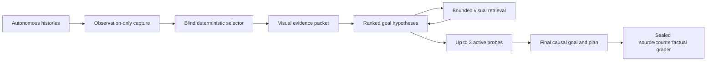

# Slice 4 — Autonomous Multimodal Evidence Packet (Qwen3.8, vision-first)

**REV 3, 2026-08-17 — implementation contract, pending operator freeze.** Rev 1 (this
file's git history) is superseded where it conflicts; the instrument pre-check and the
night-1 linkage stand. Review-round-1 requirements are implemented in this revision,
but no capability run or closure claim is authorized until the sealed gold,
pre-registration, ceiling choice, PASS certificate, and exact runtime are frozen.
One-line intent: give Qwen3.8's actual vision tower its best
shot at *causal* goal inference from *purely autonomous* experience, with active
probing, sealed grading, and a ceiling control — so that a null, if it comes, closes
the role justifiably.

**Why the preliminary run never tested this:** the harness loads through `mlx_lm`,
whose Qwen implementation **discards the visual weights**; the checkpoint carries a
complete vision encoder and was converted for `mlx-vlm`. Qwen3.8-27B is a native
image/video model (official card; e.g. BabyVision 28.9 → 65.7 across 3.6→3.8).

## The absolute constraint

> Qwen receives only autonomous experience and deterministic representations of it —
> never human actions, solved boards, human L1→L2 transitions, source truth, or
> human-derived goal feedback.

An L1→L2 transition earned by the autonomous agent itself is fair evidence. For the
stricter "before any success" question, games without autonomous completion are
reported as a separate stratum.

## 1 · Leakage enforced structurally

Three physically separate artifacts:

- `observation_log/` — frames, actions, reset boundaries and response fields actually
  observed by the autonomous system.
- `model_packet/` — selected images and exact derived summaries. **The only artifact
  visible to Qwen.**
- `sealed_ground_truth/` — human replays, source objectives, counterfactuals, grading
  rubrics. **Opened only after answers are frozen.**

The capture process may use the engine to replay autonomous histories, but the packet
builder must be physically unable to read game source or human data. **Remove the
human-derived feedback surface in the current harness** (`e2_slice.py:2173` tells Qwen
how many human solved boards exist and how often its predicate fires on them — that is
supervision from human success even with the boards hidden).

## 2 · Autonomous sources

- `e1_store_v3` — every action in `*.performs.jsonl`, episode counts, exact state
  grids (`notes/e1-store-repeats.md`).
- Replay-verified explorer routes and the **autonomous** sp80/lf52 completion captures.
- Prior autonomous-agent histories in `logs/kaggle_v4/artifacts` — retain only
  observed boards, actions and environment outcomes; **discard the previous model's
  analyses and goal guesses**.
- **Animation recapture**: replay selected autonomous action sequences and keep every
  frame the engine returns — the stores mostly retain settled endpoints, while
  animations expose movement, rotation, recolouring, consumption.

## 3 · Visual packet — exactly 10 matched evidence pages per carrier

| Page | Evidence |
|---|---|
| Opening + components | Clean 8px/cell initial board in raw; matched non-occluding boxes in overlay |
| State atlas | 12–16 structurally diverse autonomous states as thumbnails |
| Causal episode | One consecutive episode maximizing action/effect diversity |
| Action atlas | ≥1 effect and 1 no-effect observation per action |
| Matched contrasts | Same action, similar visible states, different outcomes |
| Transformation strips | Every returned frame for selected reshape/recolour/movement actions |
| Static components | Never-changed objects, not called targets or HUD |
| History exhibit | Same board + same action + different result, when actually observed |
| Autonomous completion | Last incomplete · animation · solved terminal · next board — **only if self-earned** |
| Coverage sheet | Tried/untested actions, omitted branches, conflicting observations |
| Random reserve | One seeded random transition against curator cherry-picking |

Every raw before/after contrast contains clean 4px/cell pre and settled-post boards.
Its matched overlay contains a 4px/cell marked pre, a clean 4px/cell settled post,
and a 4px/cell binary diff mask. Specialized magnified crops may supplement these,
but never replace the full-board causal pair. **Raw evidence and annotations remain
separate carriers** — never draw boxes over the only copy of a one-cell object.

The text, raw-visual, and overlay-visual carriers share the same ordered
`evidence_id` set. The initial packet is exactly 10 pages, leaving six image slots:
three independently rendered probe results and one visual retrieval result in each
of three rounds. Carrier matching is never repaired by dropping evidence from only
one arm. Multiple action contrasts may share a numbered page, but retain every
constituent transition/action reference and exact text-carrier board.

## 4 · Rendering specification

- **Canonical ARC palette** from the reference vision harness
  (`agent/reference/taaf/src/ARC3-Inference/inference/agent/vision_context.py:14`) —
  not `gi2_observation.render_crop`'s slightly different one.
- Standalone gate boards use 16px/cell (1024×1024). In the fixed packet envelope,
  the opening/component page uses 8px/cell and every full-board action panel,
  atlas, causal sequence, temporal summary, and live storyboard uses **at least
  4px/cell**, always exact nearest-neighbour. Crops remain magnified to ≥16–32
  px/cell. All outer images are ≥65,536 pixels and both dimensions are multiples of
  32, so the processor must preserve their dimensions. Never feed a raw 64×64 image.
  Use PNG frames/storyboards, not MP4: sampling can miss one-frame events and is
  harder to audit.
- ~1,024 LM image tokens per 1024×1024 board; mixed-resolution composition is used.
  **Record the actual expanded count from `image_grid_thw`** — text-tokenizer counting
  is insufficient.
- Hard per-cell limits: **12,000 checkpoint-tokenizer evidence tokens; 14,000 initial
  prompt text tokens including instructions/template; 16,384 measured visual tokens;
  16 images; 20,000 generated tokens per turn.** Initial visual evidence is capped at
  **6,448 tokens**, reserving **3 × 2,112** for one all-frame probe storyboard per
  probe and **3 × 1,200** for one composite visual retrieval per round. Compact
  storyboards use no less than 4 px/game-cell; this exception is covered by the
  packet-scale readability gate. If an action emits too many frames to fit one
  2,112-token storyboard at 4 px/cell, the cell is budget-indeterminate/instrument
  failure; the renderer must never silently fall back to 2 px or 1 px. These are
  caps, not targets; every carrier remains lossless below them.

## 5 · Text ledger — compact, exact, semantics-free

Blind game ID · action IDs and click coordinates · reset/episode boundaries ·
frame/transition/image IDs · exact changed-cell counts and bboxes · observed effect
frequencies and exceptions · episode-local component table · state/action coverage ·
provenance `OBSERVED` / `DERIVED-EXACT`.

**Excluded:** semantic assertions ("player", "goal", "HUD") unless Qwen produced them;
**miner rules are excluded from the primary arm** — empirical counts over potentially
anchoring inferred rules.

**Selection = frozen, source-blind greedy coverage** over: action IDs and click
targets · effect/no-effect · movement/appearance/disappearance/recolour/reshape · new
contacts and containment · topology changes · rare outcomes · structural state novelty
· coherent chronological coverage. Reuse the selection primitives in `e2_frames.py`
(~:401), replacing ASCII output with bitmap plates.

## 6 · Output: managed uncertainty, DSL demoted

Primary answer = ranked hypotheses (probability, necessary conditions, sufficient
condition, evidence for/against by page:transition IDs, predicted counterexample) +
best_goal (plain causal condition + structured factors) + next_probe (start state,
action, per-hypothesis predictions) + goal_directed_plan. **The DSL becomes a
secondary translation, never the primary answer** — it cannot express every objective
and encourages observational shortcuts.

## 7 · Bounded retrieval and active probing

- Retrieval over stored autonomous evidence: `SHOW_FRAME`, `SHOW_TRANSITION`,
  `SHOW_EPISODE`, `SHOW_ACTION_CONTRAST`, `SHOW_COLOUR_HISTORY` (the last accepts an
  ARC colour ID 0–15, never a `Cxxx` component ID).
- Retrieval is one request/result per round. Every successful result is one bounded
  visual composite: episode/history frame indices are mapped visibly to exact
  transition/action/click records, and action contrasts use the same deterministic
  minimum-pre-Hamming selector as the packet and show pre, settled post, and diff.
- **≤3 active probes**: replay a verified autonomous prefix, perform Qwen's requested
  action, return all raw response frames. Invalid or redundant probes consume budget;
  **no silent repair of Qwen's request**. Before any intervention, the live engine's
  exact game-source path, byte count, and SHA-256 must match the source identity bound
  into the recapture manifest; the replay driver, recapture script, and arcengine
  version must match as well. Matching only the replay prefix is insufficient.

Capable goal inference under underdetermination = naming the ambiguity and buying the
discriminating observation — not confident guessing.

## Serving path (pinned by operator)

Direct `mlx_vlm.load` + `stream_generate` — never the server, never `mlx_lm`.
- **Upgrade to `mlx-vlm 0.6.8`** to match the conversion (0.6.7 currently installed).
- `enable_thinking=True` explicitly on every template call (0.6.7's helper defaulted
  to the pre-filled non-thinking path — caught live in the rev-1 pre-check; assert
  no-prefill on the generation region every call).
- **`reasoning_effort="xhigh"`** — this is the capability upper-bound experiment; the
  affordability pin applied to the deployable config, not to this question.
- Thinking sampler per operator spec: **temperature 1.0, top-p 0.95, top-k 20**
  (supersedes the harness's temp 0.6 pin for this slice; recorded — night-1
  generations are not reproducible under this sampler and don't need to be).
- **Call the checkpoint processor's chat template directly with interleaved
  image/text items** — the mlx-vlm convenience helper prepends anonymous images and
  can destroy before/after alignment.
- Record: checkpoint revision, runtime versions, image hashes + order + dimensions,
  `image_grid_thw`, expanded prompt tokens, sampler, reasoning effort.

## Gates (all five before any capability run)

1. **Synthetic palette board**: exact colours, counts, locations.
2. **Grey/fill discrimination**: four counterbalanced equality and palette-ID cases.
3. **Packet binding and compact-storyboard readability**: 16 mixed pages under two
   permutations; every page target must move correctly, and a unique one-cell event
   must be localized by frame index and board coordinate inside the exact 28-frame,
   4-px/cell live-probe composition regime.
4. **Spatial grounding**: counterbalanced relation and marker tasks must track the
   image-conditioned truth.
5. **Production-sampler stability**: the packet-scale task must pass every frozen
   replicate under the serving sampler.

Plus fleet-calibrated budget per arm (night-1 lesson: never one cell) and the
wall model from measured envelope with images in context.

## Full diagnostic design — 4 games × 7 arms, matched

Games: **ls20** (visual containment vs shape/colour/rotation objective) · **ft09**
(old-DSL-inexpressible, no explorer completion) · **m0r0** (history-dependent) ·
**sp80** (autonomous-completion positive control).

Arms (frozen identifiers): **T** compact exact text · **V** raw visual · **O** visual
with deterministic overlays · **R** O + stored-evidence retrieval · **A** O + up to
three model-selected live probes · **C** O + three seeded control probes · **P** O +
retrieval + model-selected probes. T/V/O compare matched passive evidence IDs across
carriers. O↔R and O↔A estimate the **incremental system effects** of enabling retrieval
or active intervention, including the additional realized context; A↔C contrasts
model-selected and seeded-control probe policies, whose realized evidence may differ.
P is the best-shot system result. All arms use the same selected initial evidence IDs,
**four-call generation schedule** (initial answer plus exactly three updates), per-call
20,000-token output cap, generation seeds, decoding, and grading. Matching call count
removes the extra-compute/self-refinement confound. The neutral updates are deliberately
short and deterministic, not token- or image-length matched to realized feedback, so
these are not pure information-only causal contrasts. Missing cells inside the
declared arm set break matching; a preregistered arm subset is instead a narrower
design and cannot support claims about the omitted contrasts.

**Selected Stage-A pilot (pending freeze)**:
`notes/qwen-3.8-slice4-pilot-preregistration.json` fixes games
`{ls20,ft09,m0r0,sp80}`, arms `{T,V,O,P}`, and the single seed list `[2]`. Qwen runs
the complete 4 games × 4 arms matrix (16 cells). A transcript-matched model comparator
using the same pinned local checkpoint runs only the primary `P` arm (4 further
cells); it receives the mechanically reconstructed evidence from each corresponding
Qwen `P` cell and must provide the strict hashed execution trace. Because this is the
same model rather than an independently capable or exposure-screened respondent, its
scores are descriptive pipeline/repeatability diagnostics only and can never satisfy
a ceiling adequacy or closure condition. Omitting `R`, `A`, and `C` means this pilot
does not estimate their retrieval/probe-policy contrasts.

Every cell receives all three update calls. Passive T/V/O rounds receive the same
deterministic, 256-character-bounded `NO NEW OBSERVATION` message. An interactive
round receives that identical neutral message whenever it has no request or no valid,
fully deliverable result; it never stops early or substitutes a different request.
Interactive cells allow at most one retrieval request per round and at most three
live probes total. Every successful retrieval is one composite image of at most 1,200
visual tokens. Invalid, malformed, redundant, or unavailable requests consume the
applicable budget and are recorded exactly; unsuccessful results are not leaked as
arm-specific diagnostic hints. A successful zero-frame live execution delivers only
its exact observed response metadata. A visual result is delivered transactionally —
all pages or none — so an over-budget result makes the cell budget-indeterminate while
the remaining matched update calls receive the neutral message. Fatal serving or
instrument exceptions abort the run and are never shown as environmental evidence.

Sealed grading, five axes: 1 consistency with supplied observations · 2 source-correct
causal goal · 3 counterfactual validity · 4 confidence calibration · 5 success of the
proposed goal-directed plan.

**Ceiling control**: a transcript-matched human or model comparator receives
the exact evidence delivered to the corresponding Qwen cell, including retrieved and
probe-result images, but never hidden paths or state. Its input artifact is assembled
and hashed mechanically rather than self-attested.
Only a succeeding, exposure-screened blinded human in a separately valid Stage-B
design can make a Qwen null closure-eligible; the Stage-A model comparator cannot.
Without that human control, a null is a packet/configuration diagnostic. Stage B
cannot freeze until the operator preselects and hashes the exact ceiling identity and
aggregation rule; the ceiling cannot be shopped after Qwen's results are visible.

## Standing from rev 1 / night 1

`mlx_vlm` viability + the enable_thinking trap (pre-check below) · night-1 closure
ladder and envelope as the text-config record · mini-S1 waits until slice 4 reads out
· PUBLISHING (rendered boards local-only) · `_s4` trace tags · configuration tuple on
every conclusion.

## Flagged by the implementer (not blockers; resolved by gate or operator)

1. **xhigh wall arithmetic is unknown in the packet regime.** Night 1 measured xhigh
   only as >16,384 on a 40k text prompt. Packets are ~20k total input; xhigh closure
   there is unmeasured — the gate fleet-calibrates, and the 16-cell pilot (4×4) plus
   probe turns may not fit one night; arms are ordered so a truncated night is still
   matched (text-only + full-visual first on all four games, the middle arms second).
2. **Sampler provenance**: temp 1.0/top-p 0.95/top-k 20 adopted as pinned; recorded
   as the slice-4 sampler. (Harness history pinned 0.6 as "(w) Qwen thinking
   default" — superseded here by operator instruction.)
3. **`logs/kaggle_v4/artifacts` contents** need a build-time inventory pass to
   confirm boards/actions/outcomes are separable from the old model's analyses.

---

## Instrument pre-check — 2026-08-17 (rev 1, stands)

- `mlx_vlm` 0.6.7 loads the 0.6.8-made 8-bit conversion and generates with an image.
- ⚠ Its `apply_chat_template` **defaults to the non-thinking path** (pre-filled empty
  think block — the July mechanism), caught by the first smoke test. Pin:
  `enable_thinking=True` explicit on every call; probe asserts no-prefill on the
  generation region.
- With the kwarg: think opens/closes, and read-back passes exactly (8×8 synthetic
  grid, corner colours + background). Board-scale fidelity on real 64×64 renders is
  gate item 1.

---

## Build log — 2026-08-17

- **Serving**: `mlx-vlm` 0.6.7 → **0.6.8** (conversion-matched, no dep churn). Direct
  interleaved processor template verified on 0.6.8: thinking + ordering + grid_thw.
- **`e2_probe_vlm.py` — all four gates PASS** on 3.8-8bit (commit `14ec420`):
  palette-exact read · ordering reversal · blank/substituted pixel-tracking ·
  image-conditioned thinking. xhigh thinks on trivial boards: 432–3,566 chars.
  512×512 plates = 256 LM tokens ([1,32,32] grid) — the ~1,024/full-board estimate
  confirmed on-curve.
- **`s4_render.py`** (commit `33161c2`): canonical palette (identity-asserted against
  the probe's copy), 1024×1024 boards, ≥32 px/cell crops, %32 dims, five-panel
  exhibits with annotations on copies only, storyboards, exact decode round-trip.
- **kaggle_v4 inventory (task 5): usable and separable.** 25 games × events.jsonl
  (`board` grids + action/level/score/state/level_completed/reward per row — pure
  observations) + viewer_data.json. **Strip `transcript` and `analysis_step`** (the
  old model's analyses) and redundant `board_ascii`. **15/25 games carry ≥1
  autonomous completion** (re86 reaches L3) — the self-earned completion page exists
  far beyond sp80/lf52. Pilot impact: **ft09 moves out of the no-autonomous-completion
  stratum** (duck completed it; the explorer had not). Duck rows keep settled
  endpoint boards only — animation recapture (task 4) remains the source of
  transformation strips.

---

# REVIEW ROUND 1 (operator, 2026-08-17) — closure-grade requirements. All adopted.

Run unchanged, a null would have justified only: *"this pinned Qwen/MLX configuration
failed on these four selected games under this packet and probe budget."* The following
amend rev 2 wherever they conflict:

1. **The four games are a diagnostic pilot, never the closure sample.** The inferential
   unit is the game (n=4, hand-picked, previously studied). Stage A freezes the
   instrument on them; **Stage B confirms on unused stratified games with multiple
   generation seeds nested within game.** Without Stage B, every conclusion is
   restricted to the four cases; incomplete primary cells stay descriptive.
2. **Endpoints defined before inference.** Primary endpoint: per-game source-correct
   causal goal (axis 2), binary, against **gold facts + counterfactuals frozen before
   any generation**. Pre-registered: per-game pass rule, seed-aggregation rule,
   missing-output policy, closure threshold. Plans execute from **fresh fixed starts
   under a fixed action budget**. Ceiling preselected; **closure requires a
   transcript-matched ceiling** — it receives exactly Qwen's evidence, including
   Qwen's probe outcomes; an independently-probing ceiling is only a policy upper
   bound. Prior-exposure control: public games — ceiling humans/models must declare
   familiarity; blind game IDs everywhere.
3. **The arms are re-cut for matching.** Passive carriers share IDENTICAL initial
   evidence IDs: A-text · B-raw-visual · C-visual+overlays (same selected evidence,
   carrier only). Then, separately, best-passive vs +retrieval and vs +active-probes,
   with **fixed or seeded-random probe controls** for the probe-value comparison. The
   full system remains as the best-shot arm, labelled a system result, never a
   modality effect. A truncated night is not a matched experiment.
4. **Kaggle separation is a blocking leakage gate, not an inventory.** Measured: 3,833
   action rows + 25 initial rows interleaved with **1,379 analysis rows carrying
   prior-model transcripts and goal guesses.** A separate export process emits a
   field-allowlisted observation schema (reject free text and unknown fields), hashes
   the normalized log, and the selector runs with ONLY that artifact mounted
   read-only. Uncertain provenance → abort, never build.
5. **ft09 is completion-exposed in the admitted data** (kaggle history:
   `level_completed=true` at action 17, enters L2). It leaves the strict no-success
   stratum: **labelled completion-exposed** (option chosen over truncate/omit — best
   evidence stays, stratum is honest). Every cell records a **pre-probe answer**, and
   final answers classify as: terminal evidence initially present / acquired through
   Qwen's own probes / never present.
6. **Seeding is explicit or it is fiction.** mlx-vlm 0.6.8 with `top_k=20` bypasses
   the positioned seeded sampler and uses the global MLX RNG. Therefore:
   `mx.random.seed(s)` immediately before EVERY generation, deterministic
   game/arm/turn/replicate schedule, every effective seed recorded.
7. **Image spec is processor-real.** The checkpoint declares a 65,536-pixel minimum —
   a 128×128 crop still gets bicubic enlargement. Small crops compose onto a ≥256×256
   canvas or NN-upscale further; **assert processed dims == source dims** per image.
   Hard manifest caps per cell: image count AND measured `image_grid_thw` tokens
   (12–16 full 1024² pages ≈ 12.3–16.4k tokens before copies and strips).

**Scope guard (verbatim intent):** this experiment measures *causal goal inference*.
A null may close the wider project only because goal inference is a declared necessary
capability; it does **not** demonstrate weak mechanics understanding unless held-out
transition prediction or executed-plan performance is added.

**Probe findings (7, all P1) folded into `e2_probe_vlm.py` v2:** production-regime
fixtures (64×64 @1024², one-cell objects, all 16 palette IDs, similar greys, exact
coordinates via marker plates, packet-scale multi-image binding) · explicit seed panel
with per-call `mx.random.seed` + deterministic greedy wiring gates separated from a
production-sampler stability panel · hard template invariants in `ask` (marker exists,
open-think tail, whitespace-tolerant prefill scan, placeholder count/order == images,
serialized label→placeholder binding) · full trace retention (raw text, think, stats,
truncation classified apart from vision/format failures, prompt-token cross-check) ·
gate-4 chance control (left/right/none with swapped + blank variants; think length
diagnostic only) · PASS bound to the full serving fingerprint (weights index + shard
manifest, tokenizer/template/processor/generation configs, script + renderer + git
state, seeds, command, timestamp; the probe refuses a mismatched local checkpoint) ·
per-call atomic checkpointing with overwrite refusal.

**Probe v2.2 validity hardening:** grey equality is four-way counterbalanced and
requires both fill IDs plus equality; packet binding uses 16 mixed-format pages
(~10.7k measured visual tokens) under two frozen permutations, with mechanically
unique targets and post-permutation truth; every target must move correctly. The
processor must preserve every source dimension and stay within image/token caps.
Termination comes only from mlx-vlm's `finish_reason`; length exhaustion is
`INDETERMINATE_BUDGET`, never a model failure. Gate verdicts distinguish protocol
from semantic failure. The exact six local shards are streamed through SHA-256 and
checked against the pinned HF revision/LFS manifest; model, processor, quantization,
runtime, prompt, image, seed and token provenance are recorded. Stability requires
all of at least three production-sampler replicates and scores the full payload.

The historical v1 PASS above does **not** certify v2.2; this instrument requires a
fresh run. The Slice-4 runner must still compare its serving-compatibility identity
with the resulting PASS artifact and refuse a mismatch before any goal-inference run.

---

## PRE-REGISTRATION TEMPLATE — operator freeze required (NOT yet binding)

Review round 1, finding 2 requires these before any pilot generation. The Stage-B
sample shape, primary arm, seed aggregation, closure thresholds, rerun count, and
plan budgets below are enforced protocol constants; changing one requires a reviewed
new revision and fresh certificate before freeze. The freeze commit must land BEFORE
the first pilot cell renders.

- **Primary endpoint**: per-game binary — the final `best_goal` (post-probes) is
  source-correct *in kind* AND contains every required constraint component
  (shape / colour / rotation / relation, per the sealed checklist). Adjudicated
  against `sealed_ground_truth/` only after answers freeze.
- **Gold freeze**: per game, sealed before generation: causal completion condition
  (paraphrase + constraint checklist from source read), the counterfactual set, and
  the per-axis rubric. Hashes committed; contents local-only.
- **Pre-probe answer** is recorded in every Qwen cell. It is withheld from the
  Stage-B closure adjudication packet because its presence would distinguish Qwen
  from the one-shot human ceiling. The three-way timing classification
  {terminal-evidence-initially-present · probe-acquired · never-present} remains a
  secondary diagnostic until a separately frozen, role-matched blind protocol is
  available; it cannot affect closure.
- **Per-game pass**: primary endpoint true. Partial credit recorded, never passing.
- **Stage A (pilot, 4 games, one frozen seed)**: descriptive only — instrument freeze, no
  capability verdict. **Stage B (closure sample)**: exactly 6 unused games stratified
  3 completion-exposed / 3 no-autonomous-completion × 3 seeds nested within game;
  a game passes at exactly the predeclared ≥2/3 seeds rule.

  **Blocking exposure correction (2026-08-17): no current Stage-B holdout exists.**
  `notes/s1-clear-vs-stall.md` records source/true-goal analysis for all 25 public
  games. The earlier eight-game exposure assumption and its retrospective v1 draw
  (`tn36,ar25,cd82` / `cn04,sk48,ka59`) are therefore **void** and cannot support
  closure. The reviewed exposure cohort is now all 25 normalized-manifest games;
  all 24 games with complete `e1_store_v3` inputs are exposed, while `s5i5` is also
  exposed but lacks the complete store bundle. Consequently the live derivation
  fails closed with fewer than three unused games in each stratum.

  `s4-stage-b-holdout-selection-v2` remains prospective infrastructure for a future
  genuinely untouched inventory. The source side is deliberately two-stage: first
  `s4_grade.py --commit-stage-b-inventory --out SOURCE_COMMITMENT` atomically freezes
  every complete store game, the SHA-bound normalized-Kaggle cutoff, live allowlist
  exporter, exact canonical row schema, source identities and rederived completion
  strata. This commitment binds the candidate pool, but does **not** on its own prove
  that an operator did not inspect deterministic rankings before choosing which pool
  to commit. Therefore the public selector is intentionally non-operational and fails
  closed until a reviewed protocol pins an externally authenticated, unpredictable
  beacon released after the source commitment. Internal deterministic rankings are
  explicitly non-authorizing previews; `s4_grade.py --derive-stage-b-selection
  EXPOSURE_REGISTRY --source-inventory-commitment SOURCE_COMMITMENT --out MANIFEST`
  cannot currently create a freeze-authorizing manifest even for a large untouched
  future inventory. The
  completeness-attested registry must list exactly the reviewed 25 exposed public
  games with per-game reasons; changing that cohort requires a reviewed protocol
  revision. Once beacon admission is specified, ranking will cover every inventory
  game using a domain-separated SHA-256 of protocol + committed inventory + beacon +
  stratum + game, then filter the frozen exposure set and take the first three
  genuinely untouched games per stratum. Reason wording is audited but cannot perturb
  rank. The three ordered generation seeds derive only from the protocol constant.
  Freeze must rederive the authenticated selection, require the exact selected game
  order, and packet-bind the same producer lineage, store, and normalized-export
  bytes; any source, game, stratum, plan-length, seed or manifest drift is rejected.
- **Stage-B adjudication (authenticated v2 only)**: closure requires two
  independently committed human adjudicators. Before freeze,
  `adjudication_protocol` pins two distinct identity commitments and Ed25519 public
  keys, the private HMAC rejoin-key commitment, the blinding contract, complete-leaf
  requirement, and unanimous aggregation. V1 or unsigned material fails closed.
  Given frozen answers, the grader creates two separate, mode-0600, independently
  ordered worksheets whose HMAC-derived item IDs conceal role, logical cell, game,
  arm, and seed. The asymmetric pre-probe field is absent. Judge-facing files expose
  only keyed opaque answer commitments—never raw answer or bundle hashes—and must be
  distributed through isolated channels so each judge sees only their own file.
  The rejoin-key custodian is not an adjudicator and must not disclose item mappings
  or the other worksheet before the two-signature receipt exists; filesystem mode
  bits do not replace that custody rule.
  Each judge fills every `VERDICT_*` leaf and signs the full opaque verdict tree,
  worksheet binding, and frozen independence declaration with their private key.
  A separate **no-rejoin-key** phase verifies both signatures and writes an
  append-only two-artifact commitment receipt. Only then may the official scoring
  path load the HMAC key, validate answer/gold bindings, and rejoin items to cells.
  Exact agreement on the complete verdict tree is required; any missing value or
  component-level disagreement prevents closure. Stage A retains one role-visible
  worksheet for diagnostics only. Operationally: generate with
  `--answers ... --adjudication-key REJOIN_KEY`; each judge signs with
  `--seal-adjudication FILLED --adjudicator-signing-key JUDGE_KEY --out SIGNED`;
  commit with `--commit-adjudications SIGNED_A SIGNED_B --out RECEIPT` (this command
  accepts no rejoin key); and score only with
  `--adjudications SIGNED_A SIGNED_B --adjudication-receipt RECEIPT
  --adjudication-key REJOIN_KEY`.
- **Missing outputs**: refusal / malformed / budget-indeterminate cells are missing
  observations — outside every denominator; a game-seed with a missing primary cell
  is indeterminate and reruns once under the preregistered budget remedy before it
  may count.
- **Closure rule**: the operational gate returns
  `FAILS_REQUIRED_GOAL_INFERENCE_GATE` for the exact frozen checkpoint, runtime,
  packet and interaction interface only if Qwen passes **0/6** Stage-B
  games AND the transcript-matched ceiling passes **≥4/6 overall and ≥2/3 in each
  completion stratum** on identical evidence. The scored artifact reports Qwen and
  ceiling counts plus a verdict separately for completion-exposed and
  no-autonomous-completion games. Ceiling below either adequacy threshold makes
  closure indeterminate and indicts the packet, not the model. Any Qwen pass → the
  role stays open and characterization continues. This is a preregistered project
  go/no-go result, not a population-level claim that the model family is incapable;
  the scored artifact reports the one-sided 95% upper bound implied by 0/6.
- **Plan endpoint (secondary, axis 5)**: the `goal_directed_plan` executes from a
  fresh fixed start under an action budget of 2× the autonomous completion length
  where one exists, else 150 actions; success = level completion.
- **Ceiling (operator must preselect before freeze)**: one immutable `ceiling_spec`
  pins either an exact model/checkpoint/serving configuration or one screened,
  blinded human selected under a SHA-bound roster commitment and pre-evidence rule.
  Only the blinded-human path is closure-grade: before *any* matched evidence is
  released, an append-only familiarity commitment binds the frozen manifest,
  preregistration, ceiling spec, respondent ID, and an `unfamiliar` or
  `no_prior_exposure` declaration for every primary cell. The subsequently released
  input binds that artifact by path and full SHA-256, records the later release time
  and declarations, and hashes each cell's exact Qwen-visible evidence. Each human
  answer document binds the same respondent and commitment; a per-cell delivery
  receipt binds the input/evidence/familiarity/final-answer hashes and attests that no
  extra evidence was delivered. A model ceiling cannot credibly attest training
  familiarity and is therefore a descriptive upper-bound diagnostic only, never a
  closure control. Its execution trace must bind, per cell, the ceiling-input and
  evidence hashes, exact serialized prompt/messages, provider/model/run identity,
  immutable raw response plus run metadata, and parsed final answer.
- **Probe budget**: ≤3 active probes per cell; invalid or redundant probes consume
  budget; no silent repair (unchanged from rev 2, restated to be frozen with this
  block).

*Store inventory for the builders (measured today): `e1_store_v3` = 24 games ×
{performs.jsonl (step-ordered actions, digest refs), states.json (digest → full
64×64 grid; e.g. ar25: 602 states), transitions.jsonl, graph.json}. Recapture =
replay an episode's action list live, gate on settled frames matching stored
digests, keep every intermediate frame.*
