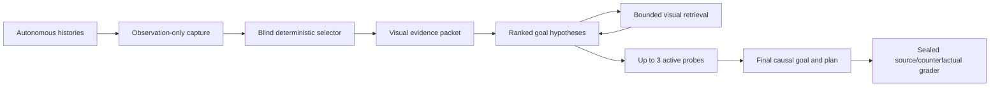

# Slice 4 — Autonomous Multimodal Evidence Packet (Qwen3.8, vision-first)

**REV 2, 2026-08-17 — operator proposal adopted as the operative spec.** Rev 1 (this
file's git history) is superseded where it conflicts; the instrument pre-check and the
night-1 linkage stand. One-line intent: give Qwen3.8's actual vision tower its best
shot at *causal* goal inference from *purely autonomous* experience, with active
probing, sealed grading, and a ceiling control — so that a null, if it comes, closes
the role justifiably.

**Why the preliminary run never tested this:** the harness loads through `mlx_lm`,
whose Qwen implementation **discards the visual weights**; the checkpoint carries a
complete vision encoder and was converted for `mlx-vlm`. Qwen3.8-27B is a native
image/video model (official card; e.g. BabyVision 28.9 → 65.7 across 3.6→3.8).

## The absolute constraint

> Qwen receives only autonomous experience and deterministic representations of it —
> never human actions, solved boards, human L1→L2 transitions, source truth, or
> human-derived goal feedback.

An L1→L2 transition earned by the autonomous agent itself is fair evidence. For the
stricter "before any success" question, games without autonomous completion are
reported as a separate stratum.

## 1 · Leakage enforced structurally

Three physically separate artifacts:

- `observation_log/` — frames, actions, reset boundaries and response fields actually
  observed by the autonomous system.
- `model_packet/` — selected images and exact derived summaries. **The only artifact
  visible to Qwen.**
- `sealed_ground_truth/` — human replays, source objectives, counterfactuals, grading
  rubrics. **Opened only after answers are frozen.**

The capture process may use the engine to replay autonomous histories, but the packet
builder must be physically unable to read game source or human data. **Remove the
human-derived feedback surface in the current harness** (`e2_slice.py:2173` tells Qwen
how many human solved boards exist and how often its predicate fires on them — that is
supervision from human success even with the boards hidden).

## 2 · Autonomous sources

- `e1_store_v3` — every action in `*.performs.jsonl`, episode counts, exact state
  grids (`notes/e1-store-repeats.md`).
- Replay-verified explorer routes and the **autonomous** sp80/lf52 completion captures.
- Prior autonomous-agent histories in `logs/kaggle_v4/artifacts` — retain only
  observed boards, actions and environment outcomes; **discard the previous model's
  analyses and goal guesses**.
- **Animation recapture**: replay selected autonomous action sequences and keep every
  frame the engine returns — the stores mostly retain settled endpoints, while
  animations expose movement, rotation, recolouring, consumption.

## 3 · Visual packet — 12–16 numbered pages per game

| Page | Evidence |
|---|---|
| Opening scene | Clean initial board at high resolution |
| Component overlay | Separate non-occluding segmentation, IDs and bounding boxes |
| State atlas | 12–16 structurally diverse autonomous states as thumbnails |
| Causal episode | One consecutive episode maximizing action/effect diversity |
| Action atlas | ≥1 effect and 1 no-effect observation per action |
| Matched contrasts | Same action, similar visible states, different outcomes |
| Transformation strips | Every returned frame for selected reshape/recolour/movement actions |
| Static components | Never-changed objects, not called targets or HUD |
| History exhibit | Same board + same action + different result, when actually observed |
| Autonomous completion | Last incomplete · animation · solved terminal · next board — **only if self-earned** |
| Coverage sheet | Tried/untested actions, omitted branches, conflicting observations |
| Random reserve | One seeded random transition against curator cherry-picking |

Every before/after exhibit:
`full-board context | magnified pre-crop | action/click marker | magnified post-crop |
binary diff mask`. **Raw evidence and annotations are separate images** — never draw
boxes over the only copy of a one-cell object.

## 4 · Rendering specification

- **Canonical ARC palette** from the reference vision harness
  (`agent/reference/taaf/src/ARC3-Inference/inference/agent/vision_context.py:14`) —
  not `gi2_observation.render_crop`'s slightly different one.
- Full boards: 16× nearest-neighbour → 1024×1024 PNG. Crops: dynamic NN scale, ≥16–32
  px per game cell. All dimensions multiples of 32. Never feed raw 64×64 (the
  processor upscales bicubically). PNG frames/storyboards, not MP4 — video sampling
  can miss one-frame events and is harder to audit.
- ~1,024 LM image tokens per 1024×1024 board; a 12-page mixed-resolution packet fits.
  **Record the actual expanded count from `image_grid_thw`** — text-tokenizer counting
  is insufficient.
- Budget shape replacing the 36–40k ASCII record: **8–12k structured text + 8–12k
  measured visual tokens + reasoning/output reserve**.

## 5 · Text ledger — compact, exact, semantics-free

Blind game ID · action IDs and click coordinates · reset/episode boundaries ·
frame/transition/image IDs · exact changed-cell counts and bboxes · observed effect
frequencies and exceptions · episode-local component table · state/action coverage ·
provenance `OBSERVED` / `DERIVED-EXACT`.

**Excluded:** semantic assertions ("player", "goal", "HUD") unless Qwen produced them;
**miner rules are excluded from the primary arm** — empirical counts over potentially
anchoring inferred rules.

**Selection = frozen, source-blind greedy coverage** over: action IDs and click
targets · effect/no-effect · movement/appearance/disappearance/recolour/reshape · new
contacts and containment · topology changes · rare outcomes · structural state novelty
· coherent chronological coverage. Reuse the selection primitives in `e2_frames.py`
(~:401), replacing ASCII output with bitmap plates.

## 6 · Output: managed uncertainty, DSL demoted

Primary answer = ranked hypotheses (probability, necessary conditions, sufficient
condition, evidence for/against by page:transition IDs, predicted counterexample) +
best_goal (plain causal condition + structured factors) + next_probe (start state,
action, per-hypothesis predictions) + goal_directed_plan. **The DSL becomes a
secondary translation, never the primary answer** — it cannot express every objective
and encourages observational shortcuts.

## 7 · Bounded retrieval and active probing

- Retrieval over stored autonomous evidence: `SHOW_FRAME`, `SHOW_TRANSITION`,
  `SHOW_EPISODE`, `SHOW_ACTION_CONTRAST`, `SHOW_COMPONENT_HISTORY`.
- **≤3 active probes**: replay a verified autonomous prefix, perform Qwen's requested
  action, return all raw response frames. Invalid or redundant probes consume budget;
  **no silent repair of Qwen's request**.

Capable goal inference under underdetermination = naming the ambiguity and buying the
discriminating observation — not confident guessing.

## Serving path (pinned by operator)

Direct `mlx_vlm.load` + `stream_generate` — never the server, never `mlx_lm`.
- **Upgrade to `mlx-vlm 0.6.8`** to match the conversion (0.6.7 currently installed).
- `enable_thinking=True` explicitly on every template call (0.6.7's helper defaulted
  to the pre-filled non-thinking path — caught live in the rev-1 pre-check; assert
  no-prefill on the generation region every call).
- **`reasoning_effort="xhigh"`** — this is the capability upper-bound experiment; the
  affordability pin applied to the deployable config, not to this question.
- Thinking sampler per operator spec: **temperature 1.0, top-p 0.95, top-k 20**
  (supersedes the harness's temp 0.6 pin for this slice; recorded — night-1
  generations are not reproducible under this sampler and don't need to be).
- **Call the checkpoint processor's chat template directly with interleaved
  image/text items** — the mlx-vlm convenience helper prepends anonymous images and
  can destroy before/after alignment.
- Record: checkpoint revision, runtime versions, image hashes + order + dimensions,
  `image_grid_thw`, expanded prompt tokens, sampler, reasoning effort.

## Gates (all four before any night)

1. **Synthetic palette board**: exact colours, counts, locations.
2. **Two-image ordering**: reverse the images, the answer must reverse.
3. **Blank/substituted image**: the answer must track the pixels.
4. **Image-conditioned thinking**: substantive open/closed think + a correct simple
   board relation.

Plus fleet-calibrated budget per arm (night-1 lesson: never one cell) and the
wall model from measured envelope with images in context.

## Decisive pilot — 4 games × 4 arms, matched

Games: **ls20** (visual containment vs shape/colour/rotation objective) · **ft09**
(old-DSL-inexpressible, no explorer completion) · **m0r0** (history-dependent) ·
**sp80** (autonomous-completion positive control).

Arms: compact text-only · raw visual · raw visual + deterministic overlays · full
visual + retrieval/probes. Selected evidence, seed, decoding, grading matched.

Sealed grading, five axes: 1 consistency with supplied observations · 2 source-correct
causal goal · 3 counterfactual validity · 4 confidence calibration · 5 success of the
proposed goal-directed plan.

**Ceiling control**: the same packet run through a human or stronger-model ceiling.
A Qwen null **with** a succeeding ceiling justifies closing the goal-inference role;
without the ceiling, a null is a packet claim. *(Open: which ceiling — operator to
pick before grading day; both is cheapest at 4 games.)*

## Standing from rev 1 / night 1

`mlx_vlm` viability + the enable_thinking trap (pre-check below) · night-1 closure
ladder and envelope as the text-config record · mini-S1 waits until slice 4 reads out
· PUBLISHING (rendered boards local-only) · `_s4` trace tags · configuration tuple on
every conclusion.

## Flagged by the implementer (not blockers; resolved by gate or operator)

1. **xhigh wall arithmetic is unknown in the packet regime.** Night 1 measured xhigh
   only as >16,384 on a 40k text prompt. Packets are ~20k total input; xhigh closure
   there is unmeasured — the gate fleet-calibrates, and the 16-cell pilot (4×4) plus
   probe turns may not fit one night; arms are ordered so a truncated night is still
   matched (text-only + full-visual first on all four games, the middle arms second).
2. **Sampler provenance**: temp 1.0/top-p 0.95/top-k 20 adopted as pinned; recorded
   as the slice-4 sampler. (Harness history pinned 0.6 as "(w) Qwen thinking
   default" — superseded here by operator instruction.)
3. **`logs/kaggle_v4/artifacts` contents** need a build-time inventory pass to
   confirm boards/actions/outcomes are separable from the old model's analyses.

---

## Instrument pre-check — 2026-08-17 (rev 1, stands)

- `mlx_vlm` 0.6.7 loads the 0.6.8-made 8-bit conversion and generates with an image.
- ⚠ Its `apply_chat_template` **defaults to the non-thinking path** (pre-filled empty
  think block — the July mechanism), caught by the first smoke test. Pin:
  `enable_thinking=True` explicit on every call; probe asserts no-prefill on the
  generation region.
- With the kwarg: think opens/closes, and read-back passes exactly (8×8 synthetic
  grid, corner colours + background). Board-scale fidelity on real 64×64 renders is
  gate item 1.

---

## Build log — 2026-08-17

- **Serving**: `mlx-vlm` 0.6.7 → **0.6.8** (conversion-matched, no dep churn). Direct
  interleaved processor template verified on 0.6.8: thinking + ordering + grid_thw.
- **`e2_probe_vlm.py` — all four gates PASS** on 3.8-8bit (commit `14ec420`):
  palette-exact read · ordering reversal · blank/substituted pixel-tracking ·
  image-conditioned thinking. xhigh thinks on trivial boards: 432–3,566 chars.
  512×512 plates = 256 LM tokens ([1,32,32] grid) — the ~1,024/full-board estimate
  confirmed on-curve.
- **`s4_render.py`** (commit `33161c2`): canonical palette (identity-asserted against
  the probe's copy), 1024×1024 boards, ≥32 px/cell crops, %32 dims, five-panel
  exhibits with annotations on copies only, storyboards, exact decode round-trip.
- **kaggle_v4 inventory (task 5): usable and separable.** 25 games × events.jsonl
  (`board` grids + action/level/score/state/level_completed/reward per row — pure
  observations) + viewer_data.json. **Strip `transcript` and `analysis_step`** (the
  old model's analyses) and redundant `board_ascii`. **15/25 games carry ≥1
  autonomous completion** (re86 reaches L3) — the self-earned completion page exists
  far beyond sp80/lf52. Pilot impact: **ft09 moves out of the no-autonomous-completion
  stratum** (duck completed it; the explorer had not). Duck rows keep settled
  endpoint boards only — animation recapture (task 4) remains the source of
  transformation strips.
